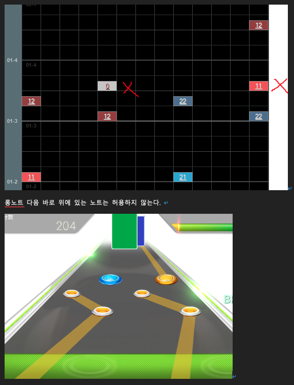
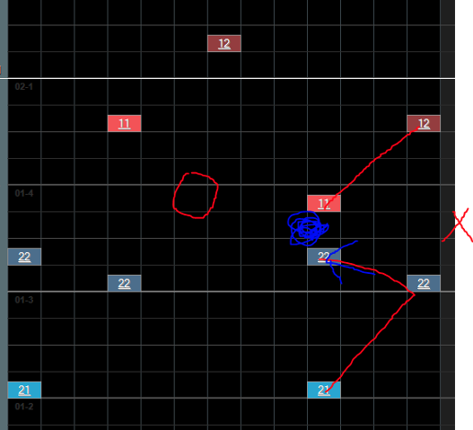
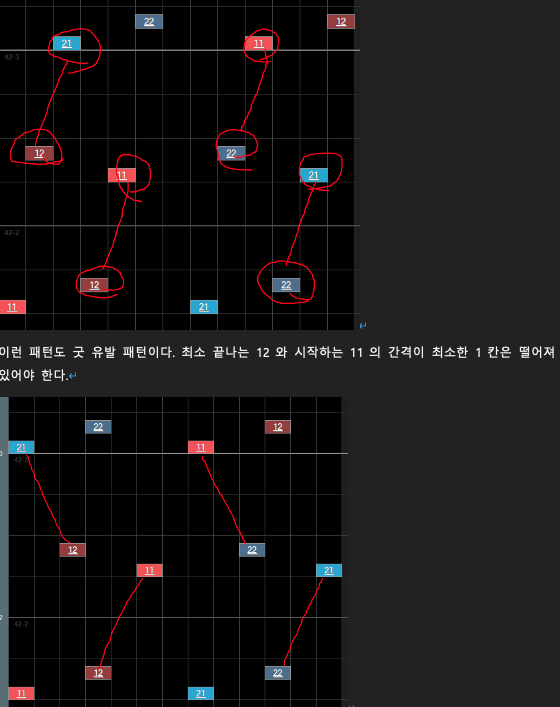

# 가이드라인 정리

가이드라인에서 우리가 필요할 것 같은 부분만 뽑아서 정리함

## 1. 음악 편집

(Cubase를 이용하기 위한 부분은 안적음)

### BPM 확인

* MixMeister BPM Analyzer 사용 

* 소수점은 버림 (65.5처럼 두배하면 정수되는 .5는 제외)

* BPM이 60~80대로 나온다면 2배를 하여 120~160BPM으로

* 패턴 툴에서 작업하기 좋은 BPM 환경은 체감상 90~180정도

* 곡 중간에 BPM이 변경되는 곡이라면 원칙적으로 사용 X (패턴 툴에서 지원 X)

### 구조

메트로놈 마디 맞추는 부분임, 필요한 부분인지 모르겠음

* Attack의 마지막 부분을 마디에 맞춘다.

* 마디 시작점에 맞게 옮겨준다. -> 음악의 구조가 바뀌는 부분에 첫 마디의 첫 박자를 맞추기

#### 못갖춘마디

시작하자 패턴나오는 것을 방지

* BPM >= 100 : 2번째 마디에 못갖춘마디 포함, 3번째 마디부터 시작

* BPM < 100 : 1번째 마디에 못갖춘 마디 포함, 2번째 마디부터 시작

### 곡

* 보통 1절까지

* 길이가 1분 이하이면 2절까지

* 추출 형식 : .ogg OggVorbis File (Codec Setting Quality 0.3), 96kbs

## 2. 노트

* 맨처음에 32번 노트 1

* 보통 노트 0

* 롱노트 11 - 12, 21 - 22

* 코멘트 노트 1000 - 1100

* 음악이 완전히 끝나고 반마디 후(맨 마지막 + 2박자)에 마지막 14번 노트 0

* 13노트 ->  7노트 -> 4노트 순으로 제작하므로 우리는 13노트부터 만들면 됨

### 노트규칙

* 동시간대에 노트 사이 거리는 무조건 3칸(롱노트 포함)

* 롱노트 규칙

* 롱노트 굿유발 오류

롱노트 끝지점 바로 위에 새로운 롱노트 -> 자동 good 판정 

최소 한 칸 이상 떨어져야 함

### 패턴 스타일

* 보통 1, 5, 9, 13을 찍는 듯? 그런데 그걸 고집하지 않고 다양하게 찍는게 좋다고 함

* 일정하게 정렬된 모양

* 바로 전에 나온 슬라이드 패턴이랑 방향도 모양도 같은데 크기는 다른 이상한 패턴 지양
